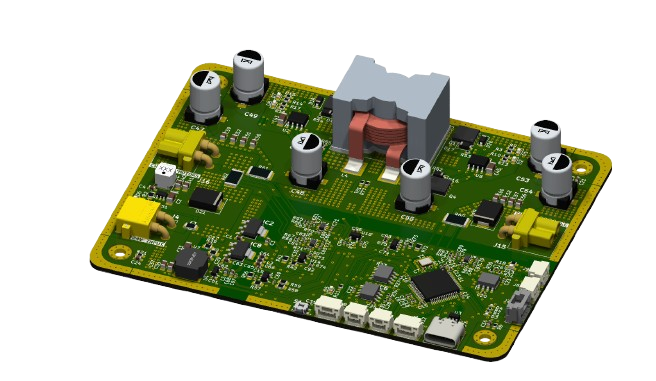
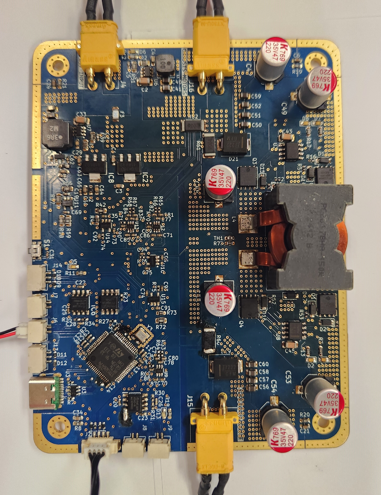
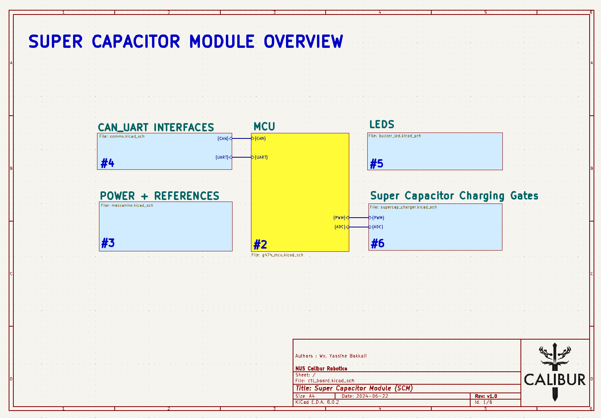
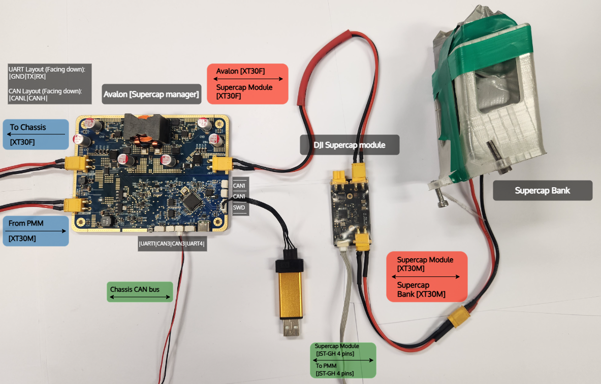
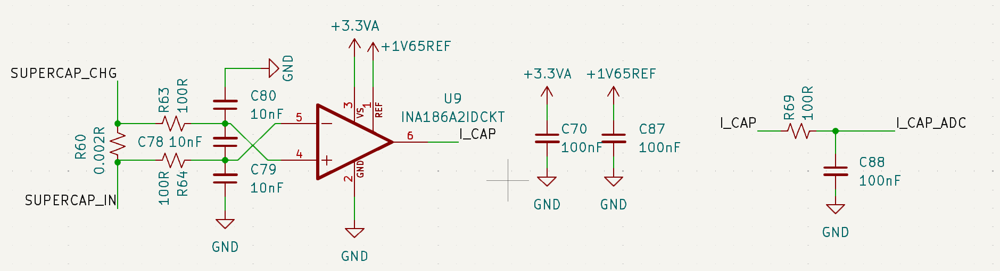
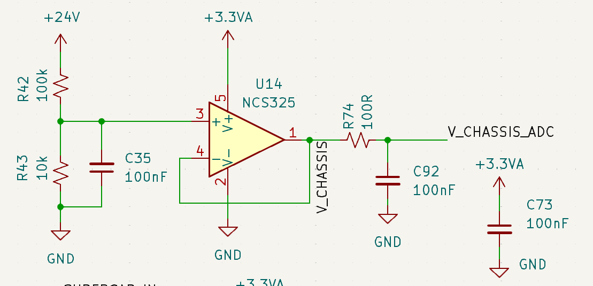

# Avalon - A supercapacitor power manager 

**Avalon** is the custom-designed supercapacitor power manager developed by the **Calibur Robotics team at the National University of Singapore (NUS)** for the **RoboMaster University Championship 2025 (RMUC)**.

This repository contains the full KiCad design files for the Avalon PCB, along with exported schematics and layout PDFs for easier reference and review. Avalon is built to manage high-speed charge and discharge cycles between the robot’s main power source and a dedicated supercapacitor bank.

## Overview

In the RoboMaster competitions, robots must obey strict power limits enforced by the referee system -- typicallycapping the power that can be drawn by the chassis motors at any time. However, short bursts of movement like sprints, collisions, or sudden maneuvers demand far more power than the allowed continuous limit. This creates a mismatch between what the robot can legally draw and what it momentarily needs.

This supercapacitor charger board acts as an intelligent power managemennt module that bridges that gap. By interfacing between the robot's power input (PMM) and supercapacitor bank, it performs real-time charge and discharge cycles to absorb excess power when available and release it when needed. This board thus allow us to perform faster an more agressive movement without breaking power rules.

## How It Works

- During low-power moments (idle, cruise), the board charges the supercaps using leftover headroom from the legal power budget
- When power spikes (e.g. assuming a 24V input, 5A+ with a 60W limit), the board discharges stored energy into the chassis to supplment the robot's main power supply.
- A bidirectional synchronous buck-boost converter, controlled by an STM32G4 microcontroller, enables saemless switching between charge and discharge modes.
- A **high-frequency PID-controlled feedback loop** regulates power transfer at around ~150kHz, ensuring safe and efficient operation.

## Schematics

The full schematics are included as a multi-page PDF [here](pdf/ctl_board.pdf).  
Each sheet is organized by subsystem:

- **Page 1**: Overview / hierarchical design
- **Page 2**: STM32G4 microcontroller and peripherals
- **Page 3**: Power supply regulation, analog references
- **Page 4**: CAN/UART communication interfaces
- **Page 6**: Miscellaneous
- **Page 7**: Main power path and buck-boost gate drivers, current/voltage sensing

Most are clearly labeled, and analog, power, and digital domains are kept well isolated.

## Wiring

The diagram below shows how Avalon is integrated into the robot's power system. It connects between the PMM (referee power module) via J4 and the supercapacitor bank via J15, and communicates with the main control board via CAN. All connectors follow our team's internal wiring standard to ensure compatibility across subsystems.

### Connector Pinout

| Connector | Type       | Function                          |
|-----------|------------|-----------------------------------|
| J4        | XT30PW-M       | Input from PMM                    |
| J15       | XT30PW-F       | Output to supercapacitor bank     |
| J16       | XT30PW-F       | Output to chassis                 |
| J15       | JST GH 4P      | SWD for programming               |
| J8        | JST GH 2P      | CAN(FD)1 communication            |
| J9        | JST GH 2P      | CAN(FD)1 communication            |
| J6        | JST GH 2P      | CAN(FD)3 communication            |
| J7        | JST GH 2P      | CAN(FD)3 communication            |
| J13       | JST GH 4P      | UART4 communication               |
| J14       | JST GH 4P      | UART4 communication               |
| J3        | USB-C          | USB-FS communication              |

## Design choices

This board follows a mixed-signal design, combining high-power switching and analog sensing, so a certain care was taken to physically separate the analog and digital domains. The power section, which includes the buck-boost stage and high-current paths, is isolated from the control logic and signal processing areas to prevent noise from contaminating ADC readings.

*This figure serves as an example of the current sensing circuit used for this board*

To ensure clean current measurements from both the A and B gates of the buck-boost converter as well as the input current, dedicated analog filtering stages were used. Each **INA186** current aplfier is paired with a symmtrical RC filter (100Ω + 10nF) on both inputs, followed by additional bypass capacitors and low-pass filtering before reaching the ADC.

*This figure serves as an example of the voltage sensing circuit used for this board*

In addition to current sensing, voltage measurements (including temperature sensing) are routed through NCS325 OpAmps in a voltage follower configuration (unity gain) with additional RC filtering on both input and output. 

Driving the power stage is an **STM32G474RETx**, chosen specifically for its **HRTIM (High-Resolution Timer)** peripheral. This allows for extremely fine PWM control at high freqencies, which is ideal for safely switching the four NMOS of our buck-boost circuit.
HRTIMs support edad-time insertion and complementary gate control, which are ssential for avoiding shoot-through in the half-bridges and for achieving reliable control at high frequencies.

Connector selection was made with system integration in mind. We stuck to the standard JST GH, and XT30 connectors already used throughout the robot platform. This keeps the board plug-and-play with existing harnesses and avoids unnecessary cable splicing or custom adapters during deployment. 

Thermally, the board is **clearly** overengineered -- 2oz copper on the surface layers, dense thermal via placement, and wie power pours ensure minimal self-heating. In fact, even under sustained 15A+ operation, thermal tests showed satisfactory temperature rise, making on the onboard temperature sesnor effectively redundant. Stil, it's included and routed with the same analog filtering as voltage signals.

## Bill of Materials (BOM)

The BOM was optimized to balance price and availability. Power-side components such as MOSFETs, gate drivers or the STM32 microcontroller were sourced from **Taobao**, while control-side parts like some analog ICs or passives were sourced from **Digi-Key** for better reliability and availability.

A complete list of components (with reference designators and supplier links) can be found in [`bom/ctl_board.csv`](bom/ctl_board.csv).

## Manufacturing Notes

The board was manufactured by JLCPCB, chosen primarily for its affordability and the ability to handle the required specs without compromise. It supports custom stackups, heavier copper layers, and precise drill tolerances at a very reasonable cost, which made it ideal for this project.

For this design, the following fabrication options were used:

- 4-layer PCB stackup using standard RF-4 substrate
- 2 oz copper weight on surface layers to handle high currents and improve thermal performance
- Thermal vias placed around high-power areas and under high-power components (MOSFET gates) to help transfer heat to internal planes
- Blue soldermask, white silkscreen
- ENIG finish (Mostly for bling)

## License

This hardware design is released under the CERN-OHL-S v2 license.  
See [`LICENSE`](LICENSE) for full terms.